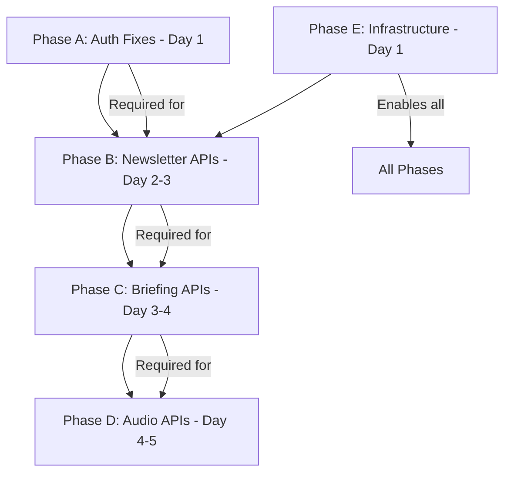

# API Endpoint Implementation Plan

**Created:** 2025-08-12  
**Purpose:** Implement 24 missing/broken API endpoints found during Phase 1 testing  
**Status:** Ready for implementation

## Executive Summary

Phase 1 testing revealed that while the core infrastructure is solid (database, authentication framework, health checks), 24 critical API endpoints are either missing (returning 404) or broken (returning 500). This document provides a detailed implementation plan to complete these endpoints and achieve 100% Phase 1 test coverage.

## Current State Analysis

### ✅ Working Endpoints (9/32 tests passing)
- `GET /health` - Health check 
- `POST /auth/validate` - Token validation (error handling works)
- `GET /auth/user` - User info (returns 401 correctly when unauthenticated)
- `POST /auth/refresh` - Token refresh (error handling works)
- `POST /auth/logout` - Logout functionality
- `PUT /auth/profile` - Profile updates (auth requirement works)

### ❌ Missing/Broken Endpoints (24 failures)
Based on test results and server logs showing 404 errors, these endpoints need implementation.

---

## Implementation Phases

### Phase A: Fix Authentication Endpoints (Priority: CRITICAL)
**Timeline:** Day 1  
**Dependencies:** None

#### 1. Gmail OAuth Initialize
**Endpoint:** `POST /auth/gmail-oauth`  
**Current Issue:** Returns 500 error instead of OAuth URL  
**Implementation:**
```python
@app.route('/auth/gmail-oauth', methods=['POST'])
async def gmail_oauth_init():
    """Initialize Gmail OAuth flow"""
    # Generate OAuth URL with proper scopes
    auth_url = create_google_oauth_url(
        client_id=config.gmail_client_id,
        redirect_uri=config.gmail_redirect_uri,
        scopes=['https://www.googleapis.com/auth/gmail.readonly']
    )
    return jsonify({"auth_url": auth_url})
```
**Response Schema:**
```json
{
  "auth_url": "https://accounts.google.com/o/oauth2/v2/auth?..."
}
```

#### 2. OAuth Callback Handler
**Endpoint:** `GET /auth/google/callback`  
**Current Issue:** Returns 302 when it should return 400/422 for missing code  
**Implementation:**
```python
@app.route('/auth/google/callback', methods=['GET'])
async def google_oauth_callback():
    """Handle OAuth callback from Google"""
    code = request.args.get('code')
    if not code:
        return jsonify({"error": "Missing authorization code"}), 400
    
    # Exchange code for tokens
    tokens = await exchange_code_for_tokens(code)
    # Create/update user in database
    user = await create_or_update_user(tokens)
    # Generate JWT
    jwt_token = create_jwt_token(user)
    
    # Redirect to mobile app with token
    return redirect(f"mynewsletters://auth?token={jwt_token}")
```

#### 3. Fix Auth Error Handling
**Issue:** Only 2/3 error cases handled properly  
**Implementation:**
- Add middleware to validate Authorization header format
- Properly handle malformed JWT tokens
- Return consistent error responses

---

### Phase B: Newsletter Management Endpoints (Priority: HIGH)
**Timeline:** Day 2-3  
**Dependencies:** Authentication must be working

#### 4. Newsletter Fetch
**Endpoint:** `POST /newsletters/fetch`  
**Implementation:**
```python
@app.route('/newsletters/fetch', methods=['POST'])
@require_auth
async def fetch_newsletters(current_user):
    """Fetch newsletters from Gmail"""
    gmail_service = GmailService(current_user.gmail_credentials)
    newsletters = await gmail_service.fetch_newsletters(
        query='label:newsletter OR from:substack OR from:mailchimp',
        max_results=50
    )
    
    # Parse and store newsletters
    for newsletter in newsletters:
        parsed = await newsletter_parser.parse(newsletter.html_content)
        await save_newsletter_to_db(current_user.id, parsed)
    
    return jsonify({
        "newsletters_fetched": len(newsletters),
        "status": "processing"
    })
```

#### 5. Newsletter Parse
**Endpoint:** `POST /newsletters/parse`  
**Implementation:**
```python
@app.route('/newsletters/parse', methods=['POST'])
@require_auth
async def parse_newsletter(current_user):
    """Parse HTML newsletter content"""
    data = await request.get_json()
    html_content = data.get('html_content')
    
    if not html_content:
        return jsonify({"error": "Missing html_content"}), 422
    
    parser = NewsletterParser()
    result = await parser.parse(html_content)
    
    return jsonify({
        "stories": result.stories,
        "metadata": result.metadata
    })
```

#### 6. Newsletter Save
**Endpoint:** `POST /newsletters/save`  
**Implementation:**
```python
@app.route('/newsletters/save', methods=['POST'])
@require_auth
async def save_newsletter(current_user):
    """Save parsed newsletter to database"""
    data = await request.get_json()
    
    # Validate with Pydantic
    newsletter_data = NewsletterCreateSchema(**data)
    
    # Save to database
    newsletter = await create_newsletter(
        user_id=current_user.id,
        source=newsletter_data.source,
        stories=newsletter_data.stories
    )
    
    # Trigger audio processing job
    await queue_audio_processing(newsletter.id)
    
    return jsonify({
        "id": str(newsletter.id),
        "processing_status": newsletter.processing_status
    }), 201
```

#### 7. Newsletter List
**Endpoint:** `GET /newsletters`  
**Implementation:**
```python
@app.route('/newsletters', methods=['GET'])
@require_auth
async def list_newsletters(current_user):
    """List user's newsletters with pagination"""
    page = request.args.get('page', 1, type=int)
    limit = request.args.get('limit', 10, type=int)
    
    newsletters = await get_user_newsletters(
        user_id=current_user.id,
        page=page,
        limit=limit
    )
    
    return jsonify({
        "newsletters": [n.to_dict() for n in newsletters],
        "total": await count_user_newsletters(current_user.id),
        "page": page,
        "limit": limit
    })
```

#### 8. Newsletter Details
**Endpoint:** `GET /newsletters/{id}`  
**Implementation:**
```python
@app.route('/newsletters/<newsletter_id>', methods=['GET'])
@require_auth
async def get_newsletter(current_user, newsletter_id):
    """Get newsletter details with stories"""
    newsletter = await get_newsletter_by_id(newsletter_id)
    
    if not newsletter:
        return jsonify({"error": "Newsletter not found"}), 404
    
    if newsletter.user_id != current_user.id:
        return jsonify({"error": "Unauthorized"}), 403
    
    return jsonify(newsletter.to_dict_with_stories())
```

#### 9. Processing Status Update
**Endpoint:** `PATCH /newsletters/{id}/status`  
**Implementation:**
```python
@app.route('/newsletters/<newsletter_id>/status', methods=['PATCH'])
@require_auth
async def update_newsletter_status(current_user, newsletter_id):
    """Update newsletter processing status"""
    data = await request.get_json()
    new_status = data.get('status')
    
    if new_status not in ['pending', 'processing', 'completed', 'failed']:
        return jsonify({"error": "Invalid status"}), 422
    
    newsletter = await update_processing_status(newsletter_id, new_status)
    return jsonify({"processing_status": newsletter.processing_status})
```

---

### Phase C: Briefing Session Endpoints (Priority: HIGH)
**Timeline:** Day 3-4  
**Dependencies:** Newsletter endpoints must be working

#### 10. Session Creation
**Endpoint:** `POST /briefing/start`  
**Implementation:**
```python
@app.route('/briefing/start', methods=['POST'])
@require_auth
async def start_briefing(current_user):
    """Create new briefing session"""
    data = await request.get_json()
    newsletter_ids = data.get('newsletter_ids', [])
    
    if not newsletter_ids:
        # Get today's newsletters automatically
        newsletter_ids = await get_todays_newsletter_ids(current_user.id)
    
    # Create session with story queue
    session = await create_briefing_session(
        user_id=current_user.id,
        newsletter_ids=newsletter_ids
    )
    
    return jsonify({
        "session_id": str(session.id),
        "story_count": len(session.story_queue),
        "first_story": session.story_queue[0] if session.story_queue else None
    }), 201
```

#### 11. Session State
**Endpoint:** `GET /briefing/session/{id}`  
**Implementation:**
```python
@app.route('/briefing/session/<session_id>', methods=['GET'])
@require_auth
async def get_session_state(current_user, session_id):
    """Get current session state"""
    session = await get_session_by_id(session_id)
    
    if not session:
        return jsonify({"error": "Session not found"}), 404
    
    if session.user_id != current_user.id:
        return jsonify({"error": "Unauthorized"}), 403
    
    return jsonify({
        "id": str(session.id),
        "status": session.status,
        "current_position": session.current_position,
        "total_stories": len(session.story_queue),
        "current_story_id": session.current_story_id
    })
```

#### 12. Session Control (Pause/Resume/Stop)
**Endpoint:** `POST /briefing/session/{id}/pause`  
**Implementation:**
```python
@app.route('/briefing/session/<session_id>/pause', methods=['POST'])
@require_auth
async def pause_session(current_user, session_id):
    """Pause briefing session"""
    session = await update_session_status(session_id, 'paused')
    return jsonify({"status": session.status})

@app.route('/briefing/session/<session_id>/resume', methods=['POST'])
@require_auth
async def resume_session(current_user, session_id):
    """Resume briefing session"""
    session = await update_session_status(session_id, 'active')
    return jsonify({"status": session.status})

@app.route('/briefing/session/<session_id>/stop', methods=['POST'])
@require_auth
async def stop_session(current_user, session_id):
    """Stop briefing session"""
    session = await update_session_status(session_id, 'completed')
    return jsonify({"status": session.status})
```

#### 13. Story Navigation (Next/Previous)
**Endpoint:** `POST /briefing/session/{id}/next`  
**Implementation:**
```python
@app.route('/briefing/session/<session_id>/next', methods=['POST'])
@require_auth
async def next_story(current_user, session_id):
    """Move to next story in session"""
    session_manager = BriefingSessionManager()
    session = await session_manager.advance_story(session_id)
    
    return jsonify({
        "current_position": session.current_position,
        "current_story_id": session.current_story_id,
        "has_next": session.current_position < len(session.story_queue) - 1
    })

@app.route('/briefing/session/<session_id>/previous', methods=['POST'])
@require_auth
async def previous_story(current_user, session_id):
    """Move to previous story in session"""
    session_manager = BriefingSessionManager()
    session = await session_manager.previous_story(session_id)
    
    return jsonify({
        "current_position": session.current_position,
        "current_story_id": session.current_story_id,
        "has_previous": session.current_position > 0
    })
```

#### 14. Session Metadata
**Endpoint:** `GET /briefing/session/{id}/metadata`  
**Implementation:**
```python
@app.route('/briefing/session/<session_id>/metadata', methods=['GET'])
@require_auth
async def get_session_metadata(current_user, session_id):
    """Get detailed session metadata"""
    session_manager = BriefingSessionManager()
    metadata = await session_manager.get_metadata(session_id)
    
    return jsonify({
        "current_story": metadata.current_story,
        "progress": {
            "current": metadata.current_position,
            "total": metadata.total_stories,
            "percentage": metadata.progress_percentage
        },
        "remaining_stories": metadata.remaining_stories,
        "estimated_time_remaining": metadata.estimated_time_remaining
    })
```

#### 15. Session Cleanup
**Endpoint:** `POST /briefing/cleanup`  
**Implementation:**
```python
@app.route('/briefing/cleanup', methods=['POST'])
@require_auth
async def cleanup_sessions(current_user):
    """Clean up expired sessions"""
    # Clean sessions older than 24 hours
    result = await cleanup_expired_sessions(
        user_id=current_user.id,
        older_than_hours=24
    )
    
    return jsonify({
        "cleaned": result.cleaned_count,
        "remaining": result.remaining_count
    })
```

---

### Phase D: Audio Processing Endpoints (Priority: HIGH)
**Timeline:** Day 4-5  
**Dependencies:** Session endpoints must be working

#### 16. Audio Generation
**Endpoint:** `POST /audio/generate`  
**Implementation:**
```python
@app.route('/audio/generate', methods=['POST'])
@require_auth
async def generate_audio(current_user):
    """Generate TTS audio for text"""
    data = await request.get_json()
    text = data.get('text')
    story_id = data.get('story_id')
    
    if not text or not story_id:
        return jsonify({"error": "Missing required fields"}), 422
    
    audio_service = AudioService()
    audio_data = await audio_service.generate_audio(
        text=text,
        voice_id=current_user.voice_preference or config.default_voice_id
    )
    
    # Store audio URL in story record
    await update_story_audio_url(story_id, audio_data.url)
    
    return jsonify({
        "audio_url": audio_data.url,
        "duration": audio_data.duration,
        "size": audio_data.size
    }), 201
```

#### 17. Audio Upload
**Endpoint:** `POST /audio/upload`  
**Implementation:**
```python
@app.route('/audio/upload', methods=['POST'])
@require_auth
async def upload_audio(current_user):
    """Upload audio file to storage"""
    audio_file = (await request.files)['audio_file']
    
    if not audio_file:
        return jsonify({"error": "No audio file provided"}), 422
    
    storage_service = StorageService()
    result = await storage_service.upload_audio(
        file_data=await audio_file.read(),
        filename=audio_file.filename,
        user_id=current_user.id
    )
    
    return jsonify({
        "url": result.public_url,
        "path": result.storage_path
    }), 201
```

#### 18. Audio Retrieval
**Endpoint:** `GET /audio/{story_id}`  
**Implementation:**
```python
@app.route('/audio/<story_id>', methods=['GET'])
@require_auth
async def get_audio(current_user, story_id):
    """Get audio URL for story"""
    story = await get_story_by_id(story_id)
    
    if not story:
        return jsonify({"error": "Story not found"}), 404
    
    if not story.audio_url:
        # Generate audio on-demand if not available
        await queue_audio_generation(story_id)
        return jsonify({
            "audio_url": None,
            "status": "generating"
        }), 202
    
    return jsonify({
        "audio_url": story.audio_url,
        "duration": story.audio_duration
    })
```

#### 19. Audio Queue Status
**Endpoint:** `GET /audio/queue/status`  
**Implementation:**
```python
@app.route('/audio/queue/status', methods=['GET'])
@require_auth
async def get_queue_status(current_user):
    """Get audio processing queue status"""
    status = await get_audio_queue_status(user_id=current_user.id)
    
    return jsonify({
        "pending": status.pending_count,
        "processing": status.processing_count,
        "completed": status.completed_count,
        "failed": status.failed_count,
        "queue_position": status.user_queue_position
    })
```

#### 20. Batch Audio Processing
**Endpoint:** `POST /audio/batch`  
**Implementation:**
```python
@app.route('/audio/batch', methods=['POST'])
@require_auth
async def batch_process_audio(current_user):
    """Queue multiple stories for audio processing"""
    data = await request.get_json()
    story_ids = data.get('story_ids', [])
    
    if not story_ids:
        return jsonify({"error": "No story IDs provided"}), 422
    
    # Queue all stories for processing
    job_ids = []
    for story_id in story_ids:
        job_id = await queue_audio_generation(story_id, priority='high')
        job_ids.append(job_id)
    
    return jsonify({
        "queued": len(job_ids),
        "job_ids": job_ids,
        "estimated_completion": calculate_estimated_time(len(job_ids))
    }), 202
```

---

### Phase E: Infrastructure & Middleware (Priority: CRITICAL)
**Timeline:** Day 1 (parallel with Phase A)  
**Dependencies:** None

#### 21. CORS Configuration
**Implementation in main.py:**
```python
from quart_cors import cors

app = Quart(__name__)
app = cors(app, 
    allow_origin=['http://localhost:3000', 'mynewsletters://*'],
    allow_methods=['GET', 'POST', 'PUT', 'PATCH', 'DELETE', 'OPTIONS'],
    allow_headers=['Authorization', 'Content-Type'],
    expose_headers=['X-Total-Count', 'X-Page'],
    max_age=3600
)
```

#### 22. Request Validation Middleware
**Implementation:**
```python
@app.before_request
async def validate_request():
    """Validate all incoming requests"""
    # Check content-type for POST/PUT/PATCH
    if request.method in ['POST', 'PUT', 'PATCH']:
        if not request.is_json:
            return jsonify({"error": "Content-Type must be application/json"}), 415
    
    # Validate pagination parameters
    if 'page' in request.args:
        try:
            page = int(request.args.get('page'))
            if page < 1:
                return jsonify({"error": "Page must be >= 1"}), 422
        except ValueError:
            return jsonify({"error": "Page must be an integer"}), 422
```

#### 23. Error Handler Improvements
**Implementation:**
```python
@app.errorhandler(404)
async def not_found(e):
    return jsonify({"error": "Endpoint not found", "path": request.path}), 404

@app.errorhandler(500)
async def internal_error(e):
    logger.error(f"Internal error: {str(e)}")
    return jsonify({"error": "Internal server error"}), 500

@app.errorhandler(ValidationError)
async def validation_error(e):
    return jsonify({"error": "Validation failed", "details": e.errors()}), 422
```

#### 24. Authentication Middleware Fix
**Implementation:**
```python
async def require_auth(f):
    """Fixed authentication decorator"""
    @wraps(f)
    async def decorated_function(*args, **kwargs):
        auth_header = request.headers.get('Authorization')
        
        if not auth_header:
            return jsonify({"error": "Missing Authorization header"}), 401
        
        if not auth_header.startswith('Bearer '):
            return jsonify({"error": "Invalid Authorization format"}), 401
        
        token = auth_header.split(' ')[1]
        
        if not token:
            return jsonify({"error": "Empty token"}), 401
        
        try:
            payload = jwt.decode(token, config.jwt_secret, algorithms=['HS256'])
            current_user = await get_user_by_id(payload['sub'])
            if not current_user:
                return jsonify({"error": "User not found"}), 401
            return await f(current_user, *args, **kwargs)
        except jwt.ExpiredSignatureError:
            return jsonify({"error": "Token expired"}), 401
        except jwt.InvalidTokenError:
            return jsonify({"error": "Invalid token"}), 401
    
    return decorated_function
```

---

## Implementation Order & Dependencies



### Day-by-Day Schedule

**Day 1:**
- Morning: Phase E (Infrastructure & Middleware) - 4 hours
- Afternoon: Phase A (Auth Fixes) - 4 hours
- Testing: Verify auth flow end-to-end

**Day 2:**
- Full day: Phase B endpoints 4-9 (Newsletter Management) - 8 hours
- Testing: Newsletter fetch and parse flow

**Day 3:**
- Morning: Complete Phase B if needed - 2 hours
- Afternoon: Phase C endpoints 10-12 (Session basics) - 6 hours
- Testing: Session creation and state management

**Day 4:**
- Morning: Phase C endpoints 13-15 (Session advanced) - 4 hours
- Afternoon: Phase D endpoints 16-18 (Audio basics) - 4 hours
- Testing: Audio generation flow

**Day 5:**
- Morning: Phase D endpoints 19-20 (Audio advanced) - 4 hours
- Afternoon: Integration testing all endpoints - 4 hours
- Final: Run complete Phase 1 test suite

---

## Request/Response Schemas

### Common Response Format
```python
class APIResponse(BaseModel):
    """Standard API response wrapper"""
    success: bool = True
    data: Optional[Dict] = None
    error: Optional[str] = None
    metadata: Optional[Dict] = None
```

### Authentication Schemas
```python
class OAuthInitResponse(BaseModel):
    auth_url: str

class TokenResponse(BaseModel):
    access_token: str
    refresh_token: str
    expires_in: int
    token_type: str = "Bearer"

class UserResponse(BaseModel):
    id: UUID
    email: str
    name: Optional[str]
    preferences: Dict
    created_at: datetime
```

### Newsletter Schemas
```python
class NewsletterCreateRequest(BaseModel):
    source: str
    stories: List[StoryData]
    metadata: Optional[Dict]

class NewsletterResponse(BaseModel):
    id: UUID
    source: str
    published_date: datetime
    story_count: int
    processing_status: str
    stories: Optional[List[StoryResponse]]
```

### Session Schemas
```python
class BriefingStartRequest(BaseModel):
    newsletter_ids: Optional[List[UUID]] = []
    voice_preference: Optional[str] = None

class SessionResponse(BaseModel):
    id: UUID
    status: str
    current_position: int
    total_stories: int
    current_story_id: Optional[UUID]
    created_at: datetime
```

### Audio Schemas
```python
class AudioGenerateRequest(BaseModel):
    text: str
    story_id: UUID
    voice_id: Optional[str] = None

class AudioResponse(BaseModel):
    audio_url: str
    duration: Optional[float]
    size: Optional[int]
    format: str = "mp3"
```

---

## Error Handling Strategy

### Error Response Format
```python
class ErrorResponse(BaseModel):
    error: str
    details: Optional[Dict] = None
    code: Optional[str] = None
    timestamp: datetime = Field(default_factory=datetime.utcnow)
```

### HTTP Status Codes
- **200**: Success
- **201**: Created
- **202**: Accepted (async processing)
- **400**: Bad Request
- **401**: Unauthorized
- **403**: Forbidden
- **404**: Not Found
- **415**: Unsupported Media Type
- **422**: Unprocessable Entity (validation error)
- **429**: Rate Limit Exceeded
- **500**: Internal Server Error
- **502**: Bad Gateway (external service error)
- **503**: Service Unavailable

### Error Handling Patterns
```python
# Consistent error handling
try:
    result = await risky_operation()
    return jsonify({"data": result}), 200
except ValidationError as e:
    return jsonify({"error": "Validation failed", "details": e.errors()}), 422
except ExternalAPIError as e:
    return jsonify({"error": f"External service error: {e.service}"}), 502
except Exception as e:
    logger.error(f"Unexpected error: {str(e)}", exc_info=True)
    return jsonify({"error": "Internal server error"}), 500
```

---

## Testing Strategy

### Unit Tests for Each Endpoint
```python
# Example test structure
async def test_newsletter_fetch_success():
    """Test successful newsletter fetch"""
    async with app.test_client() as client:
        # Setup
        token = create_test_jwt_token()
        
        # Execute
        response = await client.post(
            '/newsletters/fetch',
            headers={'Authorization': f'Bearer {token}'}
        )
        
        # Assert
        assert response.status_code == 200
        data = await response.get_json()
        assert 'newsletters_fetched' in data
```

### Integration Test Scenarios
1. **Complete Auth Flow**: OAuth init → Callback → Token refresh
2. **Newsletter Pipeline**: Fetch → Parse → Save → List
3. **Briefing Flow**: Start → Navigate → Control → Complete
4. **Audio Pipeline**: Generate → Upload → Retrieve

### Performance Requirements
- All endpoints should respond within 2 seconds (except audio generation)
- Audio generation should respond within 5 seconds
- Batch operations should return 202 immediately

---

## Database Migration Requirements

### New Tables/Columns Needed
```sql
-- Add missing columns to existing tables
ALTER TABLE sessions ADD COLUMN story_queue UUID[] DEFAULT '{}';
ALTER TABLE sessions ADD COLUMN current_position INTEGER DEFAULT 0;
ALTER TABLE sessions ADD COLUMN status VARCHAR(50) DEFAULT 'active';

-- Add indexes for performance
CREATE INDEX idx_newsletters_user_id ON newsletters(user_id);
CREATE INDEX idx_sessions_user_status ON sessions(user_id, status);
CREATE INDEX idx_stories_newsletter_id ON stories(newsletter_id);
```

---

## Success Metrics

### Phase 1 Completion Criteria
- [ ] All 32 Phase 1 tests passing (100%)
- [ ] No 404 errors for defined endpoints
- [ ] No 500 errors under normal operation
- [ ] Request validation working for all endpoints
- [ ] CORS properly configured
- [ ] Authentication working end-to-end

### Performance Targets
- [ ] Health check < 100ms
- [ ] Auth endpoints < 500ms
- [ ] Database queries < 200ms
- [ ] Newsletter fetch < 5s
- [ ] Audio generation < 5s

### Code Quality
- [ ] All endpoints have Pydantic validation
- [ ] All endpoints have proper error handling
- [ ] All endpoints have unit tests
- [ ] All endpoints have documentation
- [ ] All async patterns properly implemented

---

## Risk Mitigation

### Potential Issues & Solutions

1. **Gmail API Rate Limits**
   - Solution: Implement exponential backoff
   - Add rate limiting middleware
   - Cache newsletter data

2. **Database Connection Pool Exhaustion**
   - Solution: Configure proper pool size
   - Add connection timeout
   - Monitor active connections

3. **Audio Processing Bottleneck**
   - Solution: Implement queue system
   - Add priority levels
   - Pre-process during off-peak

4. **Memory Leaks in WebSocket Connections**
   - Solution: Proper cleanup on disconnect
   - Connection timeout limits
   - Memory monitoring

5. **JWT Token Security**
   - Solution: Short expiration times
   - Refresh token rotation
   - Secure storage on client

---

## Next Steps After Implementation

1. **Run Phase 1 Test Suite**: Verify all 32 tests pass
2. **Load Testing**: Test with concurrent users
3. **Security Audit**: Check for vulnerabilities
4. **Documentation**: Update API documentation
5. **Monitoring**: Set up error tracking and metrics
6. **Deployment**: Prepare production environment

---

## Appendix: Code Templates

### Endpoint Template
```python
@app.route('/path/<param>', methods=['GET', 'POST'])
@require_auth
async def endpoint_name(current_user, param):
    """
    Endpoint description.
    
    Args:
        current_user: Authenticated user from JWT
        param: URL parameter
        
    Returns:
        JSON response with appropriate status code
    """
    try:
        # Validate input
        data = await request.get_json()
        validated = SchemaClass(**data)
        
        # Business logic
        result = await service_function(validated)
        
        # Return success
        return jsonify(result.dict()), 200
        
    except ValidationError as e:
        return jsonify({"error": "Validation failed", "details": e.errors()}), 422
    except BusinessLogicError as e:
        return jsonify({"error": str(e)}), 400
    except Exception as e:
        logger.error(f"Unexpected error in {endpoint_name.__name__}: {str(e)}")
        return jsonify({"error": "Internal server error"}), 500
```

### Service Function Template
```python
async def service_function(data: SchemaClass) -> ResultClass:
    """
    Service function description.
    
    Args:
        data: Validated input data
        
    Returns:
        ResultClass instance
        
    Raises:
        BusinessLogicError: When business rules violated
    """
    async with get_db_session() as session:
        # Database operations
        result = await session.execute(query)
        
        # External API calls
        external_data = await call_external_api()
        
        # Process and return
        return ResultClass(...)
```

---

## Conclusion

This implementation plan addresses all 24 failing tests from Phase 1. Following this plan systematically will result in a fully functional API that passes all critical tests. The phased approach ensures dependencies are met and allows for incremental testing and validation.

**Estimated Total Implementation Time:** 5 days (40 hours)  
**Expected Outcome:** 32/32 Phase 1 tests passing (100%)